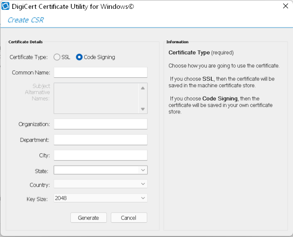

I'm about to release my first Electron-Based Open Source App (EBOSA?), for which you can read more about it [here](/stahp). And after fighting a bit with `electron-forge,` I'm reaching the final steps.

Code signing is one of them, and if you are not used to Desktop environments, there is a lot of jargon and confusion waiting for you.

## But wait... why codesign in the first place?

I guess you already know this, but if you don't Codesign your App, Windows will treat it as one of the Horsemen of the apocalypse. First, your browser will not allow you to download the `.exe,` and if you manage to convince it to do so, Windows will show the "You are installing a virus, but we just saved you from doing so" screen:

Chrome:

Windon't:

Too much friction if you want your App to reach as many users as possible, so let's fix it:

## 1 - Buy a Codesigning Certificate

There are two options, each with its pros and cons:

### a - Buy an EV certificate

__Pros__: EV certificates will make both the browser that Windows happy, and primarily _they work right away_

__Cons__: They are more expensive 3x vs. the Individual certificate and slightly harder to get. You'll need a hardware USB key and more steps to get the certificate itself.

### b - Buy an Individual certificate (this is what I did)

__Pros__: They are cheaper, about $85/year (you can buy one [here](https://comodosslstore.com/code-signing/comodo-individual-code-signing-certificate)), and it is slightly faster to get and use since you don't need a USB key and the verification process is quicker. 

__Cons__: The browser would let you don't load the `.exe` without problems, but it will take some installs for the Windows Smart Screen to go away (from what I've read, this varies from App to App, but it is around 100/500 installs)

## 2 - Assuming you chose option a: generate the certificate

After checking out from the Comodo store, you'll need to start the certificate generation process. They will ask you to fill a few forms and a  CSR...
 
The easiest way I've found to do this was using a tool from DigiCert that you can get [here](https://www.digicert.com/support/tools/certificate-utility-for-windows), whit this tool, the CSR generation becomes just a few clicks:

- click on Create CSR
- select Code Signing
- fill the required fields
- __choose 3072 for the Key Size option__
- click Generate

Voila! You have a CSR that you can paste in the Comodo certification generation form, and that's it (for now)!

You'll get an email saying that the Comodo team is checking your phone number, and after a couple of days, your certificate should be ready for signing.